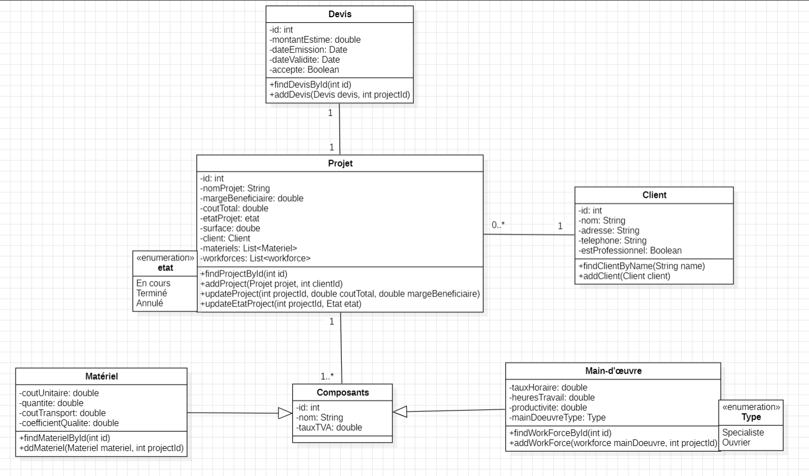

# Bati-Cuisine

## Description du projet
Bati-Cuisine est une application Java destinée aux professionnels de la construction et de la rénovation de cuisines. Elle permet d'estimer le coût total des projets en tenant compte des matériaux utilisés et des coûts de main-d'œuvre.

## Objectif général de l'application
L'objectif principal de l'application est de fournir un outil pratique et puissant pour estimer avec précision les coûts des projets de rénovation de cuisines, tout en facilitant la gestion des clients et des devis.

## Technologies utilisées
- Java (version 8 ou supérieure)
- PostgreSQL (pour la gestion de la base de données)
- JDBC (pour les opérations de base de données)
- Git (pour le contrôle de version)
- JIRA (pour la gestion des tâches)

## Structure du projet
- **models/** : Contient les classes de modèle pour représenter les entités telles que les projets, clients, matériaux, main-d'œuvre et devis.
- **config/** : Gère les fichiers de configuration, y compris les configurations de la base de données.
- **services/** : Contient la logique métier de l'application, gérant les opérations sur les projets, les devis, les matériaux, etc.
- **repository/** : Responsables de l'accès aux données.
- **view/** : Gère l'interface utilisateur, que ce soit en ligne de commande ou une future interface graphique (GUI).
- **utils/** : Contient les classes utilitaires, comme celles de validation des entrées ou de gestion des dates.

## Description brève de l'architecture adoptée
L'architecture adoptée suit une approche en couches, comprenant :
- **Couche de présentation (view)** : Gère l'interaction avec l'utilisateur.
- **Couche métier (services)** : Contient la logique de l'application.
- **Couche de persistance (repository)** : Gère l'accès aux données avec la base de données PostgreSQL.
- **Couche utilitaire (utils)** : Fournit des fonctions d'aide pour la validation des données et la gestion des dates.
- **Couche de configuration (config)** : Gère les configurations globales de l'application.

## Instructions d'installation et d'utilisation

### Prérequis
- Java 8 ou supérieur
- PostgreSQL
- Installation des fichiers (pour la gestion des dépendances)

### Étapes pour configurer la base de données

1. Créez une base de données PostgreSQL appelée `Baticuisine` :
   ```sql
   CREATE DATABASE BatiCuisine;
2.  Exécutez le fichier Schema.sql (fourni avec le projet "src/main/resources") pour créer les tables nécessaires dans la base de données.

3. Clonez le projet depuis le dépôt Git :
 ```bash
https://github.com/AkilSalah/Akil_SalahEddine_S1_B3_BatiCuisine.git 
 ```
4. Pour exécuter l'application, exécutez la commande suivante :
    ```bash 
        cd out/artifacts/BatiCuisine_jar
   ```
   ```bash
     java -jar BatiCuisine.jar
    ```

# Conception UML
## Diagramme de classe :

## Planification JIRA :


